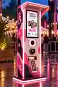

# Physical AI Photo Booth — Reference Design & Variant-Generation Prompt



> **Reference:** The pink K-pop-inspired photo booth concept shown above. This file is a **design prompt for generating new physical enclosure concepts**, not for generating the guest's AI portraits.
>
> The committed WebP is a small preview. **For best results, also attach the original high-resolution concept image when prompting Claude.** This is visual inspiration, not a dimensioned production drawing.

## Copy/paste master prompt for Claude

You are an expert **industrial/product designer and visual concept artist** designing self-service AI photo booths for festivals, fairs, shopping centres, private parties and public events.

Use the attached reference photograph as the starting point. Develop **five significantly different, exciting and genuinely buildable enclosure designs**. The goal is to create a photo booth people notice from across an event, walk over to, photograph and want to try. The booth must feel like a physical attraction—not just a screen in a rectangular box.

**First study the reference image:**

- A tall, narrow, **freestanding, single-sided walk-up kiosk**: guests stand in front; they do **not** step inside or sit in a cabin.
- A clean, rounded, sculptural silhouette with a substantial but realistically buildable base.
- A projecting, gently rounded **rain hood/canopy** over the front, with integrated warm-white light illuminating the interface and camera area.
- A generously sized **portrait-oriented touchscreen** in the upper front, visually integrated into the casing; a welcoming, minimal photobooth start UI.
- A dedicated **camera with a circular illuminated surround**, on the front below the display in the reference.
- A **compact Nayax-style contactless payment terminal**, with a roughly **70 mm circular reader face**, on the front at an accessible standing height. It should be visibly much smaller than the camera/screen assembly, not an enormous card terminal.
- A properly recessed **photo-print exit slot** lower on the front, with a realistic short photo strip coming out.
- Continuous diffused **LED edge lighting** around selected housing corners, sides and base—visible but not a tangle of exposed LED strips.
- In the reference, pink, blush-white and very dark plum abstract shapes, lively K-pop-inspired hearts/sparkles and a glowing side graphic make the booth feel playful, fashionable and approachable.
- Festival ambience at blue hour: softly blurred warm festoon lights, coloured event lighting, damp reflective pavement. The booth is the unmistakable hero of the image.

### Engineering constraints — keep these in *every* variant

1. It must remain a **standalone walk-up photobooth**, not a room, caravan, seating enclosure, arcade cabinet or giant tablet on a stand.
2. Preserve **all four functional front elements**, arranged sensibly: portrait display, unobstructed camera, small accessible payment reader, and printer output slot. They must appear as separate real components, not decorative icons.
3. Include a modest **outdoor weather hood** that protects the display/camera from light rain without concealing the face of the kiosk. Use weather-resistant detailing; don't suggest the rendered concept is certified waterproof.
4. Design an enclosure that plausibly could be made from **folded sheet metal or CNC panels**, powder-coated parts, formed rounded corners, printed/vinyl graphics, LED diffusers and serviceable internal brackets. Use a stable base, concealed cables, and lockable service access.
5. Give the components convincing **human-scale proportions**. The payment reader is small (about 70 mm diameter), the touchscreen is much larger, the print slot is usable, and the camera sits at a workable standing-user height. Don't imply exact final dimensions from the reference image.
6. No inaccessible controls, implausibly thin structural sections, impossible cantilevers, exposed mains wiring or unsupported floating parts.
7. Make the design **playful and distinctive**, but not visually chaotic. Colour, illumination and visual identity must reinforce the overall shape.
8. Leave practical space for ventilation, a printer, computer hardware, camera mounting, payment equipment and serviceability—even though internal components are not visible in the beauty render.
9. Maintain clean sightlines to the touchscreen and camera. The printed strip must emerge from the actual print opening, not from somewhere unrelated.

### Design freedom — be bold

Do **not** produce five nearly identical kiosks in different colours. Keep the core hardware and walk-up use, but genuinely explore **different silhouettes, panel breaks, canopy shapes, lighting concepts, body graphics, materials and visual personalities**.

Produce the following five directions:

**01 — K-pop Popstar (reference evolution)**  
Take the pink original further: sculptural rounded edges, playful asymmetrical pink/cream/plum graphics, glowing hearts, polished K-pop concert energy. Improve the proportions and integration of the camera, Nayax reader and print slot. Fashionable and bold rather than childish.

**02 — Candy Arcade**  
A modern candy-coloured arcade object: soft peach, bubblegum, lavender and mint, cheeky geometric graphics, big illuminated contours, tactile rounded detailing. Cheerful and irresistible at a fairground, but still a modern commercial product.

**03 — Y2K Streetwear**  
A sharper early-2000s music-video aesthetic: silver or gunmetal, iridescent accents, electric lilac and blue, sleek sculpted panels, dynamic graphics and distinctive lighting. Cooler and more fashion-forward than the pink reference.

**04 — Future Portal**  
A striking sci-fi transformation machine: deep midnight material, cyan/magenta/purple edge light, layered portal-like geometry around the interface, elegant scanning cues. Believable fabricated hardware, not a spaceship with no service access.

**05 — Premium Event Edition**  
A more refined hotel/wedding/corporate version that is still exciting: satin ivory or champagne, smoked dark panels, warm gold-toned detailing, tasteful animated accent lighting and thoughtful curves. Sophisticated without becoming a generic rectangular terminal.

### Render requirements

For **each** direction, create **one separate image** of the complete physical photobooth:

- **Portrait-oriented render, approximately 2:3 aspect ratio** (similar framing to the reference).
- Photorealistic high-end product visualisation, not an illustration or a CAD screenshot.
- Full booth visible **from canopy to base**, uncropped, in a convincing three-quarter front perspective that also shows a side panel.
- Camera at approximately human eye level, natural perspective, realistic materials and plausible proportions.
- Outdoor festival or event setting, at dusk/blue hour, with restrained photographic depth of field and beautiful but believable reflections.
- Clear, sharp detail on the booth; atmospheric environment stays secondary.
- Screen shows a neat photo-booth welcome screen with a few sample portrait pictures, simple icons and a clear start affordance; **avoid long AI-generated text, random logos and unreadable interfaces**.
- Visible, restrained ambient LED illumination. No overexposure that hides the enclosure geometry.
- No crowds blocking the product, no extra devices, no cropped kiosk, no watermark, no conceptual callout arrows or exploded-view annotations.

### Output and iteration process

1. Briefly describe the distinctive **shape, construction approach, colour/material palette and lighting signature** for the five directions before rendering.
2. Generate the five variants **as individual images**, not a five-panel collage, and keep the framing consistent so they can be compared.
3. Every variant must be recognisably related to the attached reference yet clearly distinct in its industrial design.
4. Be critical of each concept: point out one specific fabrication, ergonomic or maintenance concern and how you would resolve it.
5. If rendering tools are available, **render the images**. If not, return five complete image-generator prompts, one per direction, ready to use.
6. After the first round, propose which **two directions** would work best for a durable, affordable real-world event kiosk and explain why.

**Design priorities:** instant visual attraction, memorable personality, ergonomic interaction, manufacturability, weather protection, easy assembly/service and believable hardware integration.

---

## Short prompt for refining a single variant

> Use the attached AI photobooth reference and the engineering constraints in `DESIGN_PROMPT.md`. Produce a **new physical enclosure concept** in the style **[VARIANT NAME]**. Keep a portrait touchscreen, front camera, tiny ~70 mm Nayax-style contactless reader, low printer exit, weather hood, diffused LED accents, stable base and serviceable sheet-metal/CNC construction. Change the silhouette, canopy, panel lines, graphics and lighting enough that it looks like a distinctly new design—not just a colour swap. Make one photorealistic **2:3 three-quarter full-product render**, festival at dusk, booth in sharp focus, no distracting text or extraneous objects.

## Where to save the generated variants

Save selected images alongside this prompt, for example:

```text
client/public/booth-designs/
├── DESIGN_PROMPT.md
├── 01-kpop-festival-preview.webp
├── 02-candy-arcade.webp
├── 03-y2k-streetwear.webp
├── 04-future-portal.webp
└── 05-premium-event.webp
```

The **Staff → Demo → Physical booths** gallery displays JPG, PNG and WebP files from this directory, sorted by filename. Markdown files are ignored. The small original preview can be replaced later with the full-resolution render.
